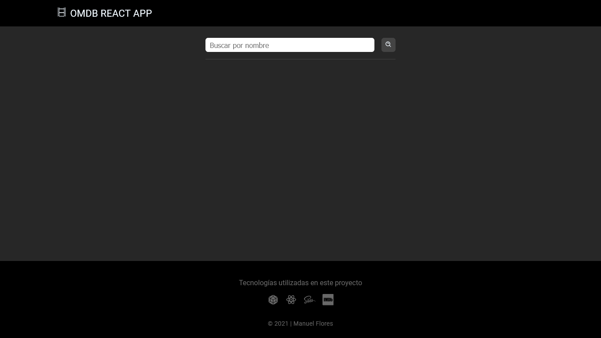
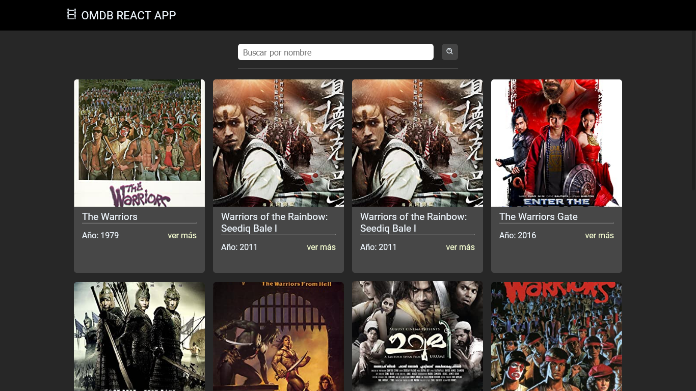
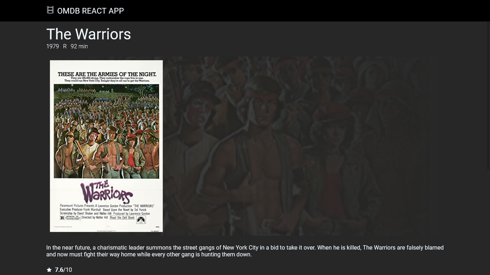

# OMDb API con REACT

Proyecto realizado con [REACT](https://es.reactjs.org/) para mostrar información de la base de datos de la API de [OMDb](http://www.omdbapi.com/)

## Imágenes

> Vista principal de la aplicación



> Resultado de búsqueda



> Detalles de un resultado específico



Instalar los módulos necesarios, en el directorio del proyecto ejecutar:

```bash
npm install
```

## Uso

```bash
npm start
```
